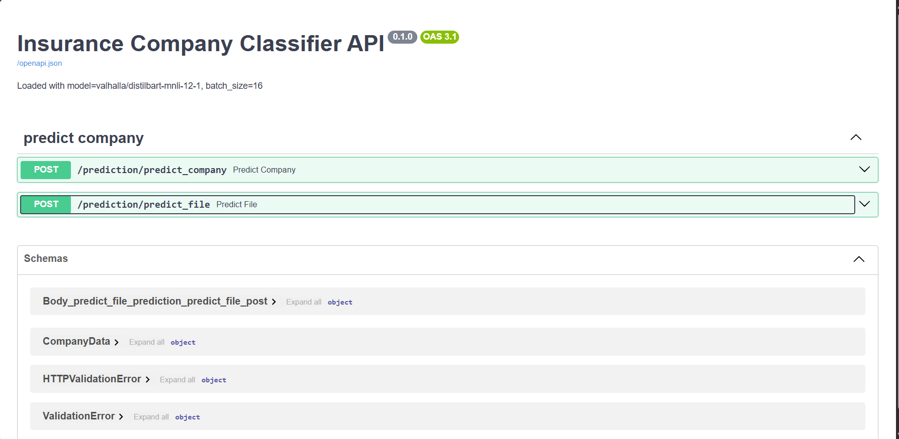
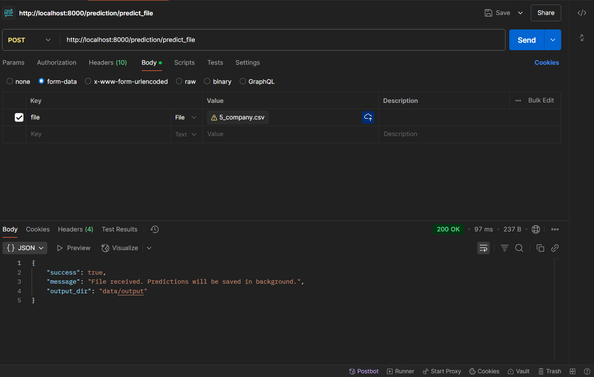
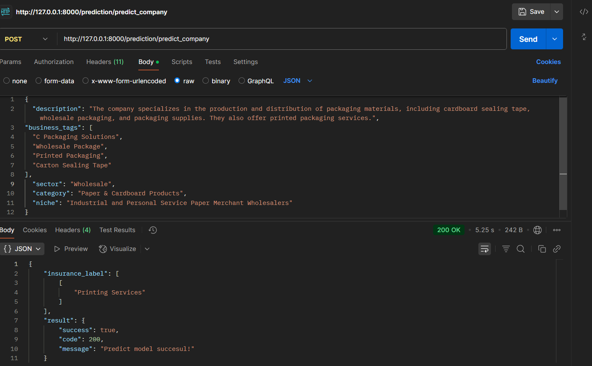
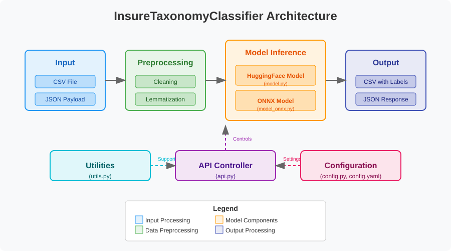

# 🧠 InsureTaxonomyClassifier

**FastAPI** + **Zero‑Shot NLP** for classifying companies within the insurance taxonomy framework.  
This service takes either a CSV file or raw text, preprocesses the data, runs inference using a zero-shot classification model, and returns relevant insurance labels.


## 🌟 Key Features

- **Zero-Shot Classification**: Leverages state-of-the-art NLP models without requiring domain-specific training
- **Batch Processing**: Efficiently processes large datasets with configurable batch sizes
- **Flexible Input**: Accepts both CSV files and direct JSON payloads
- **High Configurability**: Easy adjustment of thresholds, model parameters, and I/O directories
- **Interactive API Documentation**: Built-in Swagger UI for easy testing and integration

## 📁 Project Structure

```text
InsureTaxonomyClassifier/
├── data/
│   ├── input/              # Directory for input files
│   └── output/             # Directory where processed results are saved
├── model_taxonomy.onnx     # ONNX model file for inference
├── notebooks/
│   ├── _init_.py
│   ├── data_exploration_and_preprocessing.ipynb  # Data exploration notebook
│   └── llm_zero_shot_classification.ipynb        # Model testing notebook
├── src/
│   ├── _init_.py           # Package initialization
│   ├── api.py              # FastAPI endpoint definitions
│   ├── config.py           # Configuration parameter reading from config.yaml
│   ├── model.py            # Base model inference logic
│   ├── model_onnx.py       # ONNX-specific inference implementation
│   ├── preprocessing.py    # Text cleaning, lemmatization, and full_text formation
│   └── utils.py            # File saving, settings loading, label lists
├── venv/                   # Virtual environment (not tracked in git)
├── .gitattributes          # Git attributes file
├── .gitignore              # Git ignore file
├── config.yaml             # Batch size, thresholds, I/O directories
├── main.py                 # Main entry point for the application
├── README.md               # Documentation
└── requirements.txt        # Dependencies
```

## 🚀 Getting Started

### Environment Setup

```bash
# Create and activate virtual environment
python -m venv venv
source venv/bin/activate    # Linux/macOS  
# OR
venv\Scripts\activate       # Windows
```

### Install Dependencies

```bash
pip install -r requirements.txt
```

### Launch Server

```bash
uvicorn main:app --reload --port 8000
```

### Access Swagger UI

Open your browser and navigate to [http://localhost:8000/docs](http://localhost:8000/docs) for the interactive API documentation.



## 📌 API Endpoints

### 1. POST /prediction/predict_file

This endpoint receives a CSV file, performs batch processing on the data, and saves a new CSV in the configured output directory with an added `insurance_label` column.

#### Request Parameters:

- `file` (form-data): CSV file containing columns `description`, `business_tags`, `sector`, `category`, and `niche`

#### Processing Flow:

1. CSV file upload
2. Text preprocessing (lemmatization, cleaning)
3. Model inference in configured batches
4. Saving results to a new CSV file with predicted insurance labels

#### Example:



### 2. POST /prediction/predict_company

This endpoint receives a single company's data in JSON format and returns the predicted insurance labels.

#### Request Body:

```json
{
  "description": "The company specializes in the production and distribution of packaging materials, including cardboard sealing tape, wholesale packaging, and packaging supplies. They also offer printed packaging services.",
"business_tags": [
  "C Packaging Solutions",
  "Wholesale Package",
  "Printed Packaging",
  "Carton Sealing Tape"
],
  "sector": "Wholesale",
  "category": "Paper & Cardboard Products",
  "niche": "Industrial and Personal Service Paper Merchant Wholesalers"
}

```

#### Response:

```json
{
  "insurance_label": [
    [
      "Printing Services"
    ]
  ],
  "result": {
    "success": true,
    "code": 200,
    "message": "Predict model succesul!"
  }
}
```

#### Example:



## ⚙️ Configuration (config.yaml)

The application is highly configurable through the `config.yaml` file:

```yaml
preprocess:
  data_file: None
  input_dir: "data/input"
  output_dir: "data/output"

model_params:
  batch_size: 16
  model_name: "valhalla/distilbart-mnli-12-1"
  model_task: "zero-shot-classification"
  model_device: 0     # 0 for GPU, -1 for CPU
  predict_threshold: 0.7
  top_predict: 3
```

All settings (batch size, thresholds, directories) are centralized in this configuration file and loaded in `src/config.py` using Pydantic Settings.

## 🧩 Architecture

The system follows a streamlined pipeline architecture:

```
Input (CSV/JSON) → Preprocessing → Model Inference → Output (Save/Return)
```



## 🔍 Model Details

The classifier uses a zero-shot text classification approach with the following characteristics:

- **Base Model**: `valhalla/distilbart-mnli-12-1` (configurable)
- **Classification Type**: Multi-label zero-shot classification
- **Threshold**: 0.7 (configurable)
- **Labels Per Company**: Up to 3 (configurable)

### Candidate Labels

The system classifies companies into insurance categories including but not limited to:

- Property Insurance
- Liability Insurance
- Cyber Insurance
- Health Insurance
- Life Insurance
- Auto Insurance
- Business Interruption Insurance
- Professional Indemnity Insurance

## 🧪 Performance Considerations

- **Batch Size**: Adjust based on available memory and processing power
- **Model Device**: Set to 0 for GPU acceleration, -1 for CPU
- **Thresholds**: Higher values increase precision but may reduce recall

## 📄 License

This project is distributed under a <a href="https://github.com/Bahna-Darius/InsureTaxonomyClassifier/blob/main/LICENSE.md" target="_blank">Apache License 2.0</a>. See the LICENSE file for details.

## 👤 Author

This project was created and is maintained by Bahna Darius. You can find me on [LinkedIn](https://www.linkedin.com/in/darius-bahn%C4%83-2224b7264/).
